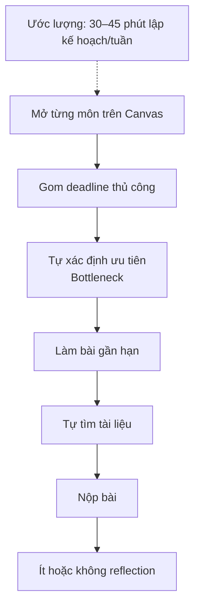
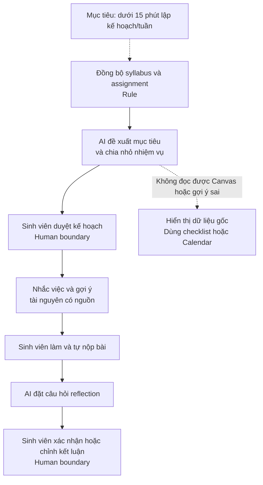
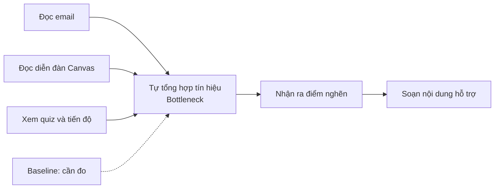
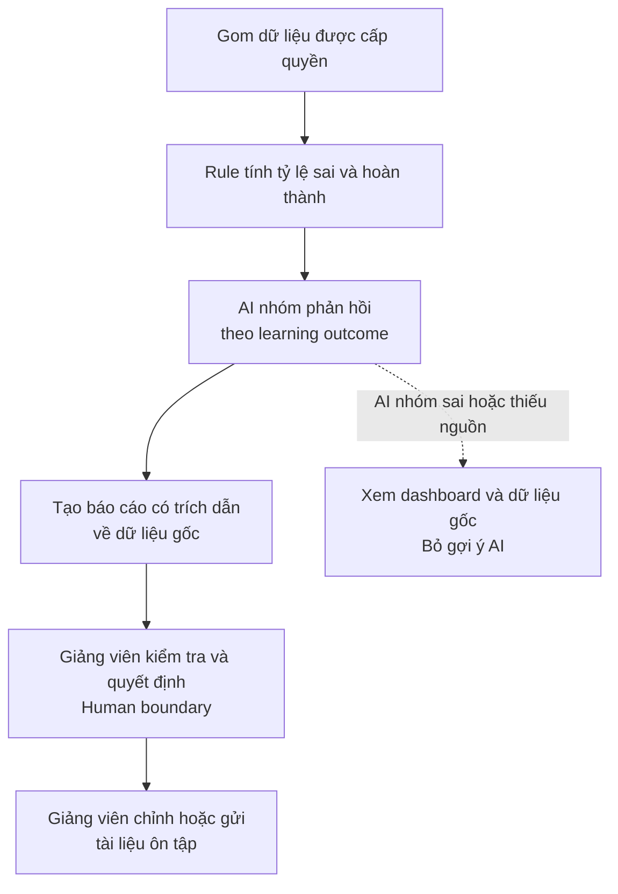
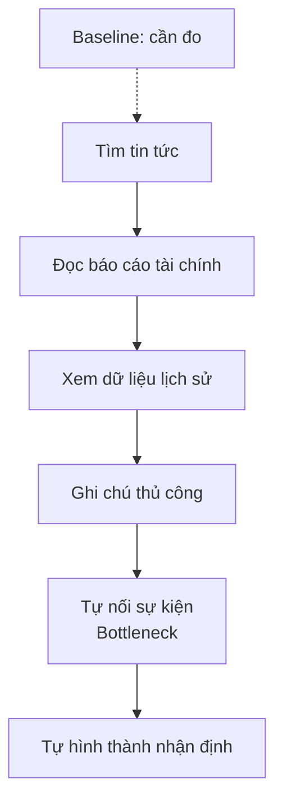
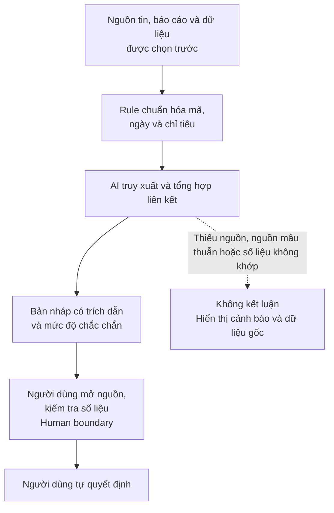

# Individual Problem Scan — Day 02

| Họ và tên | Mã học viên | Phần bài nộp |
|---|---|---|
| Đào Văn Đà | 2A202601089 | 01 — Individual Problem Scan |

## 1. Scan rộng — 8 vấn đề

| # | Lăng kính | Problem quan sát được | Ai chịu ảnh hưởng? | Dấu hiệu thật / cách kiểm chứng |
|---:|---|---|---|---|
| 1 | Tốn thời gian, AI có thể hỗ trợ | Thông tin đầu tư nằm rải rác trong tin tức, giá lịch sử và báo cáo tài chính; các sự kiện lại ảnh hưởng lẫn nhau nên khó tổng hợp thành bức tranh nhất quán. | Nhà đầu tư cá nhân tự nghiên cứu cổ phiếu | Phải mở nhiều nguồn và tự đối chiếu; đo bằng thời gian nghiên cứu một mã, số nguồn đã đọc và số thông tin quan trọng bị bỏ sót. |
| 2 | Lặp lại, AI có thể hỗ trợ | Sinh viên học nhiều môn trên Canvas, deadline dày đặc nên thường chỉ chạy theo bài, thiếu kế hoạch tuần và bước tự nhìn lại tiến độ. | Sinh viên Trường đại học X dùng Canvas LMS | Deadline phân tán giữa nhiều môn; kiểm chứng bằng tỷ lệ nộp đúng hạn, số deadline bỏ sót và phỏng vấn 5–10 sinh viên. |
| 3 | Pain từ người khác, tốn thời gian | Giảng viên khó nhận ra sớm phần kiến thức mà cả lớp đang vướng vì phản hồi nằm rải rác trong email, diễn đàn, quiz và tiến độ bài tập. | Giảng viên và sinh viên Trường đại học X | Vấn đề thường chỉ rõ sau khi nhiều sinh viên làm sai hoặc hỏi lặp lại; kiểm chứng bằng thời gian tổng hợp, số câu hỏi trùng và thời điểm phát hiện điểm nghẽn. |
| 4 | Tốn thời gian | Khi đến nơi không quen, khách du lịch phải đọc nhiều review và đối chiếu vị trí, giờ mở cửa, giá, khẩu vị để chọn quán ăn hoặc địa điểm phù hợp. | Khách du lịch tự túc | Phải chuyển qua nhiều ứng dụng; đo thời gian từ lúc tìm đến khi chốt và tỷ lệ địa điểm không phù hợp/đã đóng cửa. |
| 5 | Lặp lại | Người dùng có nguyên liệu trong tủ lạnh nhưng khó nghĩ ra món phù hợp, dẫn đến mua thêm hoặc để thực phẩm hết hạn. | Người tự nấu ăn tại nhà | Thực phẩm bị bỏ phí hoặc mất thời gian tìm công thức; đo số nguyên liệu dùng được, thời gian chọn món và lượng thực phẩm bỏ đi. |
| 6 | AI có thể hỗ trợ | Ghi nhận calo thủ công đòi hỏi tìm từng món và ước lượng khẩu phần, ảnh món ăn không cho biết chắc thành phần và khối lượng. | Người theo dõi dinh dưỡng | Nhật ký dễ thiếu hoặc sai; so sánh kết quả ước lượng từ ảnh với khẩu phần cân thực tế và thông tin dinh dưỡng chuẩn. |
| 7 | AI có thể hỗ trợ, rủi ro cao | Khối lượng ảnh y tế lớn có thể làm dấu hiệu bất thường bị phát hiện muộn; việc đọc ảnh cần chuyên môn và kiểm chứng lâm sàng. | Bác sĩ/chuyên gia chẩn đoán hình ảnh và bệnh nhân | Kiểm chứng bằng bộ dữ liệu đã gán nhãn, độ nhạy/độ đặc hiệu và đánh giá của bác sĩ. AI chỉ được sàng lọc/hỗ trợ, không tự chẩn đoán. |
| 8 | Lặp lại, tốn thời gian | Lộ trình tốt thay đổi theo thời gian thực; người đi đường khó tự kết hợp quãng đường, mật độ giao thông và khả năng ùn tắc theo giờ. | Người đi làm và tài xế trong đô thị | Thời gian đến nơi biến động, thường phải đổi đường, đo thời gian thực tế, độ trễ so với dự báo và số lần đổi tuyến. |

## 2. Chọn Top 3

Tiêu chí: actor rõ, workflow vẽ được, bottleneck cụ thể, impact đo được, có thể thử trong phạm vi nhỏ và có thể so sánh No AI / Rule / Workflow / Agent.

| Rank | Problem | Vì sao chọn | Điều còn chưa chắc |
|---:|---|---|---|
| 1 | Learning Companion trên Canvas | Gần với bối cảnh sinh viên, workflow Plan–Do–Reflect rõ, có thể đo tỷ lệ nộp đúng hạn. | Quyền truy cập Canvas, mức độ sinh viên duy trì sử dụng và baseline thật. |
| 2 | Trợ lý phát hiện điểm nghẽn của lớp | Actor và nguồn dữ liệu rõ, tác động đến cả lớp, giảng viên có thể giữ quyền quyết định. | Cách gom email/Canvas hợp lệ, tiêu chí thế nào là một “điểm nghẽn chung”. |
| 3 | Tổng hợp thông tin cho nhà đầu tư cá nhân | Pain lớn, nhiều nguồn liên kết và AI có thể hỗ trợ tổng hợp/ngôn ngữ. | Độ tin cậy nguồn, dữ liệu trả phí, cách đo “hữu ích” và nguy cơ bị hiểu thành khuyến nghị đầu tư. |

---

## 3. Top 3 Problem Cards

### 3.1. Problem Card #1 — Learning Companion trên Canvas

#### Problem một câu

Sinh viên Trường đại học X học nhiều môn trên Canvas phải tự ghép deadline, mục tiêu và tiến độ, nên dễ chạy theo bài, bỏ sót nhiệm vụ và ít phản tư về cách học.

#### Actor

Sinh viên Trường đại học X học từ 4 môn trở lên trên Canvas.

#### Thời điểm / bối cảnh

Lập kế hoạch đầu tuần, thực hiện bài trong tuần và nhìn lại sau mỗi deadline. Vấn đề xuất hiện hằng ngày và hằng tuần.

#### Current workflow — 6 bước

1. Mở từng môn trên Canvas để xem thông báo và assignment.
2. Tự ghi deadline vào lịch hoặc ghi nhớ.
3. Chọn bài gần hạn nhất để làm.
4. Tự tìm tài liệu khi gặp khó.
5. Nộp bài và chuyển ngay sang nhiệm vụ tiếp theo.
6. Ít khi nhìn lại tiến độ, điểm mạnh và điểm yếu.

#### Bottleneck

Bước 1–3: thông tin phân tán theo từng môn và sinh viên phải tự chuyển danh sách deadline thành kế hoạch khả thi. Thời gian ban đầu **ước lượng 30–45 phút/tuần**, chưa tính các lần kiểm tra lại.

#### Impact

- Dấu hiệu quan sát: nhiều môn và deadline cùng lúc làm sinh viên ưu tiên theo việc gần hạn thay vì theo mục tiêu học tập.
- Tác động cần đo: deadline bị bỏ sót, bài nộp muộn, thời gian kiểm tra Canvas và mức độ hoàn thành kế hoạch tuần.
- Cần phỏng vấn 5–10 sinh viên và lấy baseline Canvas trong 4 tuần gần nhất nếu được phép.

#### Success metric

Trong pilot 4 tuần với một nhóm nhỏ:

- tăng tỷ lệ nộp đúng hạn so với baseline 4 tuần trước;
- giảm ít nhất 50% số deadline bị bỏ sót;
- ít nhất 70% nhiệm vụ tuần có trạng thái được cập nhật;
- sinh viên hoàn thành tối thiểu một lượt reflection/tuần.

Đo bằng log Canvas, kế hoạch tuần và nhật ký sử dụng; không dùng điểm số làm metric duy nhất.

#### Non-AI alternative

Đồng bộ deadline sang Calendar, dùng checklist tuần và template reflection. Cách này có thể xử lý phần nhắc việc, nhưng chưa tự chia nhỏ assignment, gợi ý tài nguyên theo ngữ cảnh hoặc đối thoại phản tư.

#### AI hypothesis

Một **workflow AI Plan–Do–Reflect**:

- **Plan:** đọc syllabus/assignment được cấp quyền, đề xuất mục tiêu tuần và chia nhỏ nhiệm vụ;
- **Do:** nhắc việc và gợi ý tài nguyên môn học kèm trích nguồn;
- **Reflect:** đặt câu hỏi tự đánh giá sau mỗi mốc và tóm tắt điểm mạnh/yếu để sinh viên tự xác nhận.

AI không làm bài, không tự nộp bài và không tự khẳng định sinh viên đã hiểu.

#### Quick gut

**Workflow**, vì chu trình và các điểm kiểm tra đã rõ. Chưa cần Agent tự lập kế hoạch hoặc hành động ngoài phạm vi được sinh viên duyệt.

#### Draft current workflow — trước tối ưu

#### Draft future workflow — sau tối ưu

#### Giả định cần kiểm chứng

- Sinh viên cho phép truy cập dữ liệu môn học cần thiết.
- Việc thiếu kế hoạch là nguyên nhân đáng kể của nộp muộn.
- Nhắc việc không tạo thêm quá tải thông báo.

---

### 3.2. Problem Card #2 — Trợ lý phát hiện điểm nghẽn của lớp

#### Problem một câu

Giảng viên Trường đại học X phải đọc phản hồi rải rác từ email, diễn đàn Canvas, quiz và tiến độ bài tập nên khó phát hiện sớm điểm kiến thức mà nhiều sinh viên đang cùng gặp khó.

#### Actor

Giảng viên phụ trách một lớp có nhiều hoạt động trên Canvas. Sinh viên là actor hưởng lợi khi khó khăn được phát hiện sớm.

#### Thời điểm / bối cảnh

Trước và sau mỗi buổi học, quiz hoặc deadline.

#### Current workflow — 6 bước

1. Đọc email và câu hỏi trên diễn đàn.
2. Xem kết quả quiz.
3. Kiểm tra mức độ hoàn thành assignment.
4. Tự ghi nhớ hoặc tổng hợp các tín hiệu.
5. Nhận ra câu hỏi/chỗ sai lặp lại.
6. Chuẩn bị giải thích hoặc bài ôn tập.

#### Bottleneck

Bước 4–5: giảng viên phải tự liên kết tín hiệu từ nhiều nguồn để xác định lỗi cá nhân hay điểm nghẽn chung. Baseline cần đo bằng time log trong 2–4 tuần.

#### Impact

- Câu hỏi và kết quả học tập nằm ở nhiều kênh, khó nhìn toàn cảnh cùng lúc.
- Phát hiện muộn có thể khiến nhiều sinh viên tiếp tục hiểu sai.
- Cần đo số câu hỏi trùng, tỷ lệ sai theo learning outcome và khoảng thời gian từ khi tín hiệu xuất hiện đến khi giảng viên can thiệp.

#### Success metric

Trong pilot một môn học trong 4 tuần:

- giảm ít nhất 50% thời gian giảng viên tổng hợp tín hiệu hằng tuần;
- phát hiện điểm nghẽn trong vòng 24 giờ sau quiz/deadline;
- ít nhất 80% nhóm vấn đề do AI gợi ý được giảng viên đánh giá là đúng hoặc hữu ích;
- không công bố hoặc sử dụng gợi ý trước khi giảng viên duyệt.

#### Non-AI alternative

Dashboard cố định theo tỷ lệ sai, tag câu hỏi theo chủ đề và form phản hồi chung. Rule đủ cho thống kê có cấu trúc, nhưng khó gom các câu hỏi tự do có cách diễn đạt khác nhau.

#### AI hypothesis

AI gom và nhóm các tín hiệu đã được cấp quyền theo chủ đề/learning outcome, trích dẫn nguồn, cảnh báo điểm nghẽn chung và draft gợi ý ôn tập. Giảng viên kiểm tra dữ liệu gốc, sửa và quyết định có sử dụng hay không.

#### Quick gut

**Workflow**, kết hợp rule cho số liệu quiz/hoàn thành và AI cho việc nhóm câu hỏi, tóm tắt. Không cần Agent tự gửi thông báo hay tự giao bài.

#### Draft current workflow — trước tối ưu

#### Draft future workflow — sau tối ưu

#### Giả định cần kiểm chứng

- Có thể ánh xạ câu hỏi/quiz với learning outcomes.
- Dữ liệu được xử lý phù hợp với quyền riêng tư và chính sách nhà trường.
- “Thời gian thực” thực tế nên được định nghĩa là theo lô sau sự kiện, ví dụ trong 24 giờ.

---

### 3.3. Problem Card #3 — Tổng hợp thông tin cho nhà đầu tư cá nhân

#### Problem một câu

Nhà đầu tư cá nhân phải tự đọc và liên kết tin tức, giá lịch sử và báo cáo tài chính của nhiều công ty, nên mất nhiều thời gian và dễ bỏ sót mối liên hệ quan trọng trước khi tự ra quyết định.

#### Actor

Nhà đầu tư cá nhân tự nghiên cứu một nhóm cổ phiếu.

#### Thời điểm / bối cảnh

Trước khi đưa một mã vào danh sách theo dõi hoặc khi có sự kiện mới. Phạm vi ban đầu chỉ tổng hợp và truy xuất bằng chứng, không đưa lệnh mua/bán.

#### Current workflow — 6 bước

1. Tìm tin tức về công ty/ngành.
2. Mở báo cáo tài chính và báo cáo thường niên.
3. Xem dữ liệu giá, khối lượng và sự kiện lịch sử.
4. Ghi chú thủ công theo từng nguồn.
5. Tự nối sự kiện giữa công ty, ngành và thị trường.
6. Tự kiểm tra lại và hình thành nhận định.

#### Bottleneck

Bước 4–5: dữ liệu khác định dạng, khác thời điểm và có quan hệ chéo. Baseline cần đo bằng thời gian nghiên cứu một mã và số nguồn phải đối chiếu.

#### Impact

- Dữ liệu có cấu trúc và văn bản nằm ở nhiều nguồn.
- Nguồn có thể mâu thuẫn, cũ hoặc thiếu ngữ cảnh.
- Sai sót có hậu quả tài chính, nên output phải truy ngược được nguồn và không được xem là tư vấn đầu tư.

#### Success metric

Trong pilot với 5 mã và bộ câu hỏi nghiên cứu cố định:

- giảm ít nhất 50% thời gian tạo bản tổng hợp đầu tiên;
- 100% claim quan trọng có nguồn và ngày xuất bản;
- không có số liệu tài chính sai sau bước kiểm tra của người dùng;
- người dùng tìm lại được bằng chứng gốc cho mỗi liên kết được nêu.

#### Non-AI alternative

Watchlist, RSS, dashboard tài chính và template phân tích chuẩn có thể gom dữ liệu định lượng. Chúng chưa giải quyết tốt việc tóm tắt văn bản và tìm liên kết giữa nhiều sự kiện, nhưng là nền tảng an toàn trước khi dùng AI.

#### AI hypothesis

AI truy xuất từ danh sách nguồn đáng tin cậy, chuẩn hóa thực thể/thời gian, tạo bản tổng hợp các mối liên hệ và gắn nguồn cho từng claim. Người dùng kiểm tra nguồn và tự ra quyết định; hệ thống không dự báo chắc chắn, không cá nhân hóa lệnh mua/bán.

#### Quick gut

**Workflow ở scope nhỏ**. Rule dùng để lấy dữ liệu chuẩn; AI dùng để truy xuất và tổng hợp. Chưa chọn Agent vì rủi ro quyền truy cập, hành động tự động và sai lệch tài chính quá cao.

#### Draft current workflow — trước tối ưu

#### Draft future workflow — sau tối ưu

#### Giả định cần kiểm chứng

- Có nguồn dữ liệu hợp pháp, cập nhật và đủ chất lượng.
- Người dùng hiểu đây là công cụ nghiên cứu, không phải tư vấn đầu tư.
- Mối liên hệ được nêu có thể truy về bằng chứng, không chỉ là tương quan do mô hình suy diễn.

---

## 4. Card muốn pitch nhất

**Card chọn:** Problem Card #1 — Learning Companion trên Canvas.

**Vì sao:** Actor gần gũi, chu trình Plan–Do–Reflect rõ, có thể pilot nhỏ và đo bằng tỷ lệ nộp đúng hạn. Rủi ro thấp hơn bài toán tài chính/y tế vì sinh viên vẫn tự học và tự nộp bài.

**Câu hỏi muốn nhóm challenge:**

> Đồng bộ Calendar, checklist và nhắc deadline có giải quyết được phần lớn vấn đề không; AI thực sự tạo thêm giá trị ở bước chia nhỏ nhiệm vụ và reflection như thế nào?
